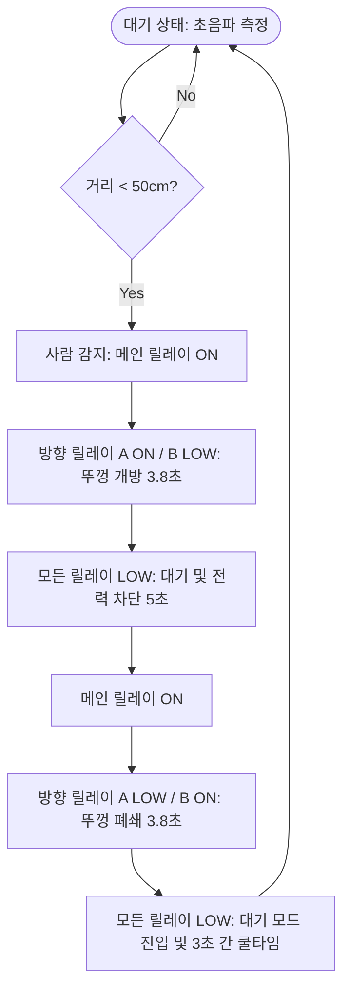

# 📦 Smart Box (스마트 수거함 시스템)

ESP32-C6와 초음파 센서, 12V 리니어 액추에이터를 연동하여 사람이 다가오면 자동으로 뚜껑을 열고 닫는 **스마트 수거함 시스템**입니다. 

기계적 내구성과 배터리 효율(대기 전력 최소화)을 고려하여 H-브리지 구동용 릴레이 회로 및 메인 전원 차단용 릴레이 회로로 설계되었습니다.

---

## 🛠️ 하드웨어 구성 요소

* **MCU**: ESP32-C6 DevKitC-1
* **센서**: 초음파 센서 (HC-SR04 또는 호환 제품)
* **액추에이터**: 12V 리니어 액추에이터 (내장 리밋 스위치 포함 권장)
* **제어 릴레이**:
  * 1채널 릴레이 (12V 메인 전원 차단용)
  * 2채널 릴레이 (액추에이터 정회전/역회전 방향 제어용)
* **전원**: ESP32 구동용 5V USB 전원 및 액추에이터 구동용 12V 배터리/어댑터

---

## 🔌 핀 맵핑 (Pin Mapping)

| 기능 (Function) | ESP32-C6 GPIO Pin | 설명 (Description) |
|:---|:---:|:---|
| **TRIG** | `GPIO 4` | 초음파 센서 트리거 신호 (Output) |
| **ECHO** | `GPIO 5` | 초음파 센서 에코 신호 (Input) |
| **RELAY_MAIN** | `GPIO 6` | 1채널 릴레이 - 12V 메인 전원 차단 제어 |
| **RELAY_DIR_A** | `GPIO 7` | 2채널 릴레이 IN1 - 모터 정회전 (개방 방향) |
| **RELAY_DIR_B** | `GPIO 8` | 2채널 릴레이 IN2 - 모터 역회전 (폐쇄 방향) |

---

## ⚙️ 주요 설정값 (Configuration)

소스 코드([main.cpp](file:///c:/Users/shcat/Documents/PlatformIO/Projects/smartbox/src/main.cpp)) 내의 주요 변수 설정을 통해 동작을 커스텀할 수 있습니다.

* `DIST_THRESHOLD` (`50`): 사람이 다가왔다고 판단할 거리 (단위: cm)
* `ACTUATOR_TIME` (`3800`): 액추에이터가 뚜껑을 완전히 열거나 닫는 데 필요한 시간 (단위: ms, 예: 3.8초)
* `WAIT_TIME` (`5000`): 뚜껑이 열린 후 쓰레기를 버릴 수 있도록 대기하는 시간 (단위: ms, 예: 5초)

---

## 🔄 동작 알고리즘 (Flow)



1. **대기 모드 (Standby)**: 0.5초 주기로 전방의 거리를 측정합니다.
2. **개방 단계 (Open)**: 거리 조건이 충족되면 메인 12V 릴레이를 켜고, 방향 제어 릴레이(A)를 활성화해 액추에이터를 뻗어 뚜껑을 엽니다.
3. **투척 대기 단계 (Wait & Save Power)**: 뚜껑이 다 열리면 모터 손상 방지 및 대기 전력 소모를 줄이기 위해 **모든 릴레이를 꺼서 전원을 완전히 차단**한 상태로 5초간 대기합니다.
4. **폐쇄 단계 (Close)**: 대기 시간이 끝나면 다시 메인 12V 릴레이를 켜고, 방향 제어 릴레이(B)를 활성화해 액추에이터를 당겨서 뚜껑을 닫습니다.
5. **정리 단계 (Cooldown)**: 닫힘 동작이 완료되면 릴레이 전원을 차단하고, 사람이 물러갈 때까지 3초간 중복 감지를 방지하기 위해 대기한 후 루프를 재시작합니다.

---

## 💻 소프트웨어 빌드 환경 설정

본 프로젝트는 [PlatformIO](https://platformio.org/) 환경에서 빌드됩니다. ESP32-C6 칩셋과 Arduino 3.x 프레임워크를 안정적으로 사용하기 위해 `pioarduino` 플랫폼 포크 버전을 사용합니다.

`platformio.ini` 파일 내용:
```ini
[env:esp32-c6-devkitc-1]
platform = https://github.com/pioarduino/platform-espressif32.git
board = esp32-c6-devkitc-1
framework = arduino
monitor_speed = 115200
board_build.flash_mode = qio
upload_port = COM4
```
