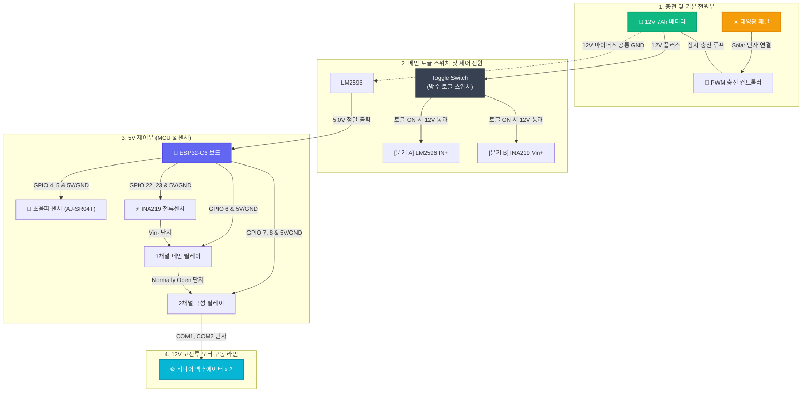

# 🔌 태양광 스마트 자동 수거함 초보자용 하드웨어 결선 가이드

본 문서는 하드웨어 결선이 낯선 초보자분들도 혼동 없이 안전하게 선을 연결할 수 있도록 단계별로 구성한 물리 배선 안내서입니다.

---

## 🗺️ 전체 시스템 연결 다이어그램 (Mermaid Map)

아래의 블록 다이어그램을 머릿속에 그리며 단계별 연결을 시작해 보세요.

---

## 🚨 초보자가 반드시 지켜야 할 3대 안전 규칙

> [!CAUTION]
> ### 1. 12V 전력선과 5V 신호선 분리!
> **배터리에서 나오는 12V 전선이 ESP32 보드의 GPIO 핀에 직접 닿는 순간 ESP32 보드는 즉시 파손됩니다.** 12V 전선은 오직 **릴레이의 은색 나사 단자(COM/NO)**와 **INA219 Vin+/-**, **LM2596 입력단(IN+/-)**에만 연결되어야 합니다.
> 
> ### 2. 결선 중에는 반드시 배터리 전원 차단!
> 전선을 나사 단자에 꼽고 조이는 조립 작업 도중에는 **토글스위치를 OFF로 두고 배터리 플러스(+) 단자에서 전선을 잠시 분리**해 두세요. 조작 실수로 전선 끝이 부딪혀 불꽃이 튀는 합선 사고를 방지합니다.
> 
> ### 3. LM2596 출력 전압 조정 필수!
> LM2596 강압 컨버터를 ESP32 보드에 꽂기 전에, 배터리 12V 전원을 넣은 뒤 **금색 일자 나사(가변저항)를 돌려 출력 전압(OUT)이 정확히 5.0V가 되는지 멀티미터로 먼저 측정**하고 꽂으셔야 합니다. (기본 출력이 12V 그대로 나가면 보드가 타버립니다.)

---

## 📌 핀-바이-핀 (Pin-by-Pin) 결선 일람표

### 1) 5V 저전력 신호선 연결 (ESP32-C6 ➔ 모듈 브레드보드/점퍼선)

| 출발지 (ESP32-C6 핀) | 도착지 (각 모듈의 핀) | 전선 기능/색상 추천 |
| :---: | :---: | :--- |
| **5V (VBUS)** | 4개 모듈의 **VCC / 5V** 단자에 공통 분기 | 🔴 빨간색 (5V 전원 공통) |
| **GND** | 4개 모듈의 **GND / Ground** 단자에 공통 분기 | ⚫ 검은색 (그라운드 공통) |
| **GPIO 4** | AJ-SR04T 초음파 센서의 **TRIG** 핀 | 🟢 초록색 (거리측정 트리거) |
| **GPIO 5** | AJ-SR04T 초음파 센서의 **ECHO** 핀 | 🟡 노란색 (거리측정 에코) |
| **GPIO 6** | 1채널 메인 릴레이의 **IN** 핀 | 🔵 파란색 (메인 전원 제어) |
| **GPIO 7** | 2채널 릴레이의 **IN1** 핀 | 🟣 보라색 (모터 정회전/열기 제어) |
| **GPIO 8** | 2채널 릴레이의 **IN2** 핀 | 🟠 주황색 (모터 역회전/닫기 제어) |
| **GPIO 22** | INA219 전류 센서의 **SDA** 핀 | 🟤 갈색 (I2C 데이터 통신) |
| **GPIO 23** | INA219 전류 센서의 **SCL** 핀 | ⚪ 흰색 (I2C 클럭 통신) |

---

## 🛠️ 12V 고전류 구동부 스텝-바이-스텝 결선 순서

### 1단계. 태양광 상시 충전 루프 형성 (안전 순서 주의)
1. **[필수: 배터리 먼저 연결] 12V 배터리의 (+) 단자**와 **(-) 단자**에서 선을 빼내어 충전 컨트롤러 두 번째의 **Battery (+) / (-)** 나사 단자에 드라이버로 단단히 조여 결선합니다.
   * *(이때 컨트롤러 화면이나 LED가 켜지며 배터리 전압을 정상적으로 인식해야 합니다.)*
2. **[그 다음: 태양광 패널 연결]** 컨트롤러가 켜진 것을 확인한 후, **태양광 패널의 빨간선(+)과 검은선(-)**을 충전 컨트롤러 맨 왼쪽의 **Solar (+) / (-)** 나사 단자에 연결합니다.
   * *결과:* 스위치를 끄더라도 태양광 패널은 365일 배터리를 상시 충전합니다.

> **💡 해체 시 안전 수칙:** 나중에 장비를 점검하거나 해체하실 일이 있다면, 설치의 역순인 **태양광 패널 선을 먼저 분리**한 뒤에 배터리 선을 가장 마지막에 분리하셔야 컨트롤러 고장을 막을 수 있습니다.

### 2단계. 메인 스위치 및 제어 전원 인입
1. **배터리의 (+) 단자**에서 나온 선 하나를 **방수 토글스위치**의 입력 핀에 꽂습니다.
2. **토글스위치의 출력 핀**에서 선을 빼내어 Y자로 두 갈래 분기합니다.
   * **[분기 A]**: **LM2596 강압 컨버터의 `IN+`** 단자에 연결합니다.
   * **[분기 B]**: **INA219 전류 센서의 녹색 터미널 블록 `Vin+`** 나사 구멍에 넣고 조입니다.
3. **배터리의 (-) 단자**에서 나온 선 하나를 분기하여 **LM2596의 `IN-`** 단자에 연결합니다.

### 3단계. H-브릿지 릴레이 전원 경로 형성 (핵심 안전 구간)
1. **INA219 전류 센서의 `Vin-`** 나사 단자 ➔ **1채널 메인 릴레이의 `COM (공통)`** 나사 단자로 연결합니다.
2. **1채널 메인 릴레이의 `NO (Normally Open, 작동 시 열림)`** 나사 단자 ➔ **2채널 릴레이의 양쪽 `NO` 단자**로 Y자 점퍼선을 연결합니다 (두 NO 단자가 12V 플러스 전원을 공유하게 만듦).
3. **배터리의 (-) 단자**에서 선을 하나 길게 빼내어 **2채널 릴레이의 양쪽 `NC (Normally Closed)`** 나사 단자에 점퍼선으로 공통 점퍼 결선합니다.

### 4단계. 액추에이터 모터선 최종 결선
1. **2채널 릴레이의 `COM1`** 단자와 **`COM2`** 단자에서 선을 하나씩 빼냅니다.
2. 두 개의 리니어 액추에이터의 모터선(검은선과 빨간선)을 병렬로 묶어 연결합니다.
   * 액추에이터 1, 2의 **빨간선 2개**를 묶어 ➔ 2채널 릴레이 **`COM1`**에 결선.
   * 액추에이터 1, 2의 **검은선 2개**를 묶어 ➔ 2채널 릴레이 **`COM2`**에 결선.
   * *동작 원리:* 2채널 릴레이의 스위칭 상태에 따라 COM1이 (+)가 되고 COM2가 (-)가 되면 모터가 뻗어 나가며(뚜껑 열림), 반대로 인가되면 안으로 수축(뚜껑 닫힘)합니다.

---

## 💡 결선 완료 후 최종 점검 리스트 (Checklist)
* [ ] 모든 5V 모듈의 VCC와 GND가 ESP32 보드에 정상 연결되었는가?
* [ ] 12V 고압 플러스 라인이 토글 스위치를 거쳐 LM2596 `IN+`와 INA219 `Vin+`에 분기되었는가?
* [ ] 2채널 릴레이의 NC 단자들은 배터리 (-)에, NO 단자들은 1채널 릴레이 NO를 거친 플러스 라인에 제대로 연결되었는가?
* [ ] 모든 전선 피복이 드러나 서로 접촉하며 쇼트(단락)를 낼 위험 요소가 없는가?

---

## 🔗 관련 문서 및 소스코드
* **메인 소스코드:** [main.cpp](../src/main.cpp)
* **통합 개발 매뉴얼:** [DEVELOPMENT_MANUAL.md](DEVELOPMENT_MANUAL.md)
* **하드웨어 BOM 명세:** [HARDWARE_BOM.md](../HARDWARE_BOM.md)
