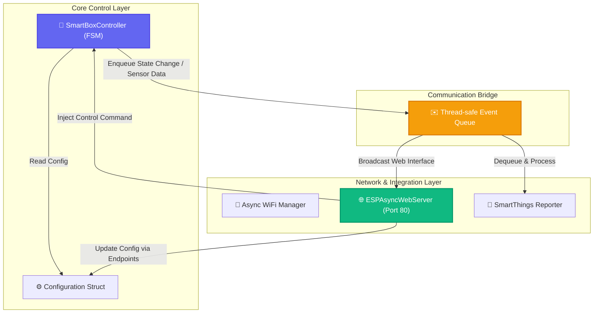
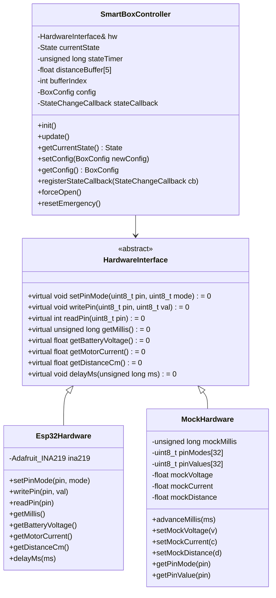

# 스마트 자동 수거함 S/W 개발 및 TDD 구현 계획

본 계획서는 **Hardware Safety First(하드웨어 안전 최우선)** 철학에 입각하여, ESP32-C6 기반 스마트 자동 수거함 시스템의 기본 안전 제어와 비동기 무선 통신(SmartThings, 웹 관리자 대시보드)을 안정적으로 구현하기 위한 통합 아키텍처 및 TDD(Test Driven Development) 구현 계획입니다.

물리적인 12V 릴레이 쇼트 위험과 하드웨어 오작동을 완전히 격리하기 위해, **하드웨어 추상화 레이어(HAL)**를 설계하여 PC 로컬 환경(`native`) 및 타겟 보드 환경 모두에서 유닛 테스트가 가능한 구조로 아키텍처를 수립합니다.

또한, 메인 제어 루프의 실시간성을 방해하지 않도록 **비동기 이벤트 기반 통신 아키텍처**를 설계에 결합합니다.

---

## User Review Required

> [!IMPORTANT]
> **하드웨어 보호용 소프트웨어 인터락(Interlock)**
> - GPIO 7(IN1)과 GPIO 8(IN2)의 동시 활성화(`LOW`)는 12V 쇼트를 발생시킬 수 있으므로, 어떤 최상위 로직에서도 직접 GPIO 제어를 하지 못하도록 제약해야 합니다.
> - 방향 전환 시 메인 전원(`GPIO 6`) 차단 후 **100ms 대기 가드 타임**을 준수하는지 유닛 테스트에서 검증해야 합니다.
> - ESP32-C6 아두이노 부팅 시 릴레이 제어 핀의 요동(글리치)을 막기 위해 `setup()` 시점에 물리적인 고임피던스(`INPUT` 모드) 및 `digitalWrite(HIGH)` 선제 처리를 적용해야 합니다.

> [!IMPORTANT]
> **네트워크와 제어 루프의 완전 격리**
> - Wi-Fi 연결 재시도나 HTTP Webhook 전송 지연(Timeout)으로 인해 모터 제어 루프 및 센서 폴링이 멈춰서는 안 됩니다.
> - 따라서 네트워크 관련 동작은 FreeRTOS의 백그라운드 태스크로 분리하고, FSM 상태 변화는 콜백 함수 포인터(이벤트 기반)를 통해 전달하여 결합도를 낮추어야 합니다.

---

## Open Questions

> [!NOTE]
> 설계 검토 결과, 추가로 논의가 필요한 오픈 질문입니다. 현재 계획에 반영된 가설을 확인해 주세요.
> 
> 1. **비동기 웹 서버 라이브러리 선정**
>    - ESP32-C6 및 Arduino 3.x 코어에 완벽히 대응하는 `ESPAsyncWebServer` 포크 버전을 사용합니다. 메인 FSM 제어 루프가 돌고 있는 동안 웹 소켓 통신이나 제어 요청이 메인 루프를 블로킹하지 않도록 검증할 예정입니다.
> 2. **비휘발성 메모리(Preferences) 쓰기 내구성**
>    - 관리자 웹에서 감도 등의 변수를 변경할 때마다 Flash 메모리에 기록(`Preferences` 이용)하므로, 설정 변경 요청 수신 직후가 아닌 2초 정도 변경이 유지될 때 기록하는 지연 저장 기법이나 단순 직접 저장을 채택하되 불필요한 연속 쓰기 루프를 방지합니다.

---

## Proposed Changes

### 1. 테스트 가능 아키텍처 (HAL) 및 비동기 이벤트 분리 설계

하드웨어 결선 정보를 직접 호출하지 않고 인터페이스를 통해 제어 및 상태 모니터링을 수행하며, 네트워크 처리는 이벤트 통로로 분리합니다.





---

### [Component: Platform Configuration]

#### [MODIFY] [platformio.ini](../platformio.ini)
- PC 로컬 환경에서 테스트를 구동할 수 있도록 `[env:native]` 환경 추가.
- `native` 환경 빌드 시 테스트용 매크로 및 필터를 설정.
- ESP32-C6 타겟 환경의 의존성에 비동기 웹 서버 및 WebSocket 라이브러리 추가.

---

### [Component: Core Architecture & HAL]

#### [NEW] [HardwareInterface.h](../src/HardwareInterface.h)
- GPIO 입출력, 시간 획득(`millis`), INA219 측정, 초음파 거리 센서 입출력을 정의하는 가상 추상 클래스.

#### [NEW] [Esp32Hardware.h](../src/Esp32Hardware.h)
- `HardwareInterface`를 상속받아 실제 ESP32-C6 및 Arduino Core API를 바인딩하는 하드웨어 제어 구현체 클래스 선언.

#### [NEW] [Esp32Hardware.cpp](../src/Esp32Hardware.cpp)
- 실제 아두이노 GPIO, `Adafruit_INA219` 객체를 통한 I2C 통신, `pulseIn`을 사용한 초음파 거리 측정 로직 구현.

#### [NEW] [MockHardware.h](../src/MockHardware.h)
- 테스트 코드 작성을 위한 테스트 더블(Mock). 
- 가상의 하드웨어 상태(핀 모드, 출력 값, 센서 값, 흐른 시간)를 개발자가 명시적으로 제어하고 검증할 수 있는 메서드 제공.

---

### [Component: State Machine & Config Logic]

#### [NEW] [SmartBoxController.h](../src/SmartBoxController.h)
- FSM 정의 및 `SmartBoxController` 클래스 선언.
- 8가지 FSM 상태 정의: `IDLE`, `OPEN_START`, `OPENING`, `HOLD`, `CLOSE_START`, `CLOSING`, `EMERGENCY_STOP`, `BATTERY_LOW_SHUTDOWN`.
- 동적 감도 변경을 위한 `BoxConfig` 구조체 및 외부 제어용 API(`forceOpen`, `resetEmergency`), 이벤트 구독 함수(`registerStateCallback`) 포함.

#### [NEW] [SmartBoxController.cpp](../src/SmartBoxController.cpp)
- `HardwareInterface` 의존성 주입을 통해 모든 하드웨어 상태를 갱신하고 상태 천이를 결정하는 핵심 FSM 알고리즘 구현.
- `AGENTS.md`에 정의된 안전 수칙 준수:
  1. GPIO 7(IN1)과 GPIO 8(IN2)의 동시 `LOW` 인가 절대 방지 (상호 배제).
  2. 제어 모드 전환 시 메인 릴레이(`GPIO 6`)를 먼저 해제(INPUT/고임피던스)하고, **100ms 대기 가드** 시간 제공.
  3. 릴레이 차단 시 `INPUT` 모드로 전환하여 대기 전력 리셋.
- 상태 변화 시 외부 콜백(`StateChangeCallback`) 호출을 연동하여 네트워크 레이어로 비동기 통지.

---

### [Component: Native/Target Testing]

#### [NEW] [test_main.cpp](../test/test_native/test_main.cpp)
- Unity Test framework를 사용하는 native 테스트 슈트 작성.
- FSM 상태 천이, 동적 감도 변수 변경 제어, 콜백 핸들링 등에 대한 단위 테스트 검증 코드 작성.

---

## Verification Plan

### Automated Tests
1. **PC 로컬 유닛 테스트 실행**
   - 아래 명령어를 통해 Native 빌드 환경에서 FSM 상태 변화와 안전 규칙을 완전 자동 검증합니다.
   ```powershell
   pio test -e native
   ```
2. **ESP32-C6 타겟 테스트 실행 (선택 사항)**
   - 보드가 연결된 환경에서 임베디드 단위 테스트를 빌드하고 구동합니다.
   ```powershell
   pio test -e esp32-c6-devkitc-1
   ```

### 단위 테스트 시나리오 목록 (TDD 구현 가이드)

#### 1단계 (RED-GREEN-REFACTOR) - 부팅 시 릴레이 글리치 차단 및 초기화 안전성 검증
- **테스트 시나리오**: `SmartBoxController`를 초기화할 때, 즉시 `GPIO 6, 7, 8`이 `INPUT`(고임피던스) 상태로 설정되는지 검증.
- **RED**: 컨트롤러 `init()` 호출 후 `MockHardware`에서 세 핀의 상태가 고임피던스 상태가 아닌 경우 단언 실패하도록 테스트 작성.
- **GREEN**: `SmartBoxController::init()`에 `pinMode(RELAY_xxx, INPUT)` 호출 및 `digitalWrite` 초기 설정 추가.
- **REFACTOR**: 핀 매핑 정보를 상수 구조체나 클래스 내에 깔끔하게 은닉하여 중복 정리.

#### 2단계 (RED-GREEN-REFACTOR) - 릴레이 인터락 및 100ms 갭 타임 가드 검증
- **테스트 시나리오**: 방향 전환(`OPEN_START` 또는 `CLOSE_START` 진입) 시, `IN1`과 `IN2`가 동시에 활성화(`LOW`)되지 않는지 실시간 감시. 또한 메인 전원을 내린 후 상태 천이가 100ms 이상 지연(안전 접점 격리)을 거친 후 전원이 공급되는지 검증.
- **RED**: 릴레이 모드를 변경할 때 100ms 타이머를 기다리지 않고 바로 공급하거나, 두 방향 제어 핀이 모두 `LOW`로 출력되는 엣지 케이스를 잡아내는 검증 코드 작성.
- **GREEN**: 100ms 가드를 `millis()` 기반 상태 천이 또는 비동기 지연 루프(`delayMs` 이용)를 사용해 엄격하게 적용.
- **REFACTOR**: 지연 및 릴레이 드라이브 제어부 모듈화.

#### 3단계 (RED-GREEN-REFACTOR) - 800mA 초과 시 비상 정지(EMERGENCY_STOP) 검증
- **테스트 시나리오**: `OPENING` 또는 `CLOSING` 상태에서 모터 전류가 800mA(또는 동적 감도값)를 넘는 순간, `EMERGENCY_STOP` 상태로 전이되고 모든 릴레이가 강제 차단(`INPUT` 모드)되는지 검증. (기동 전류 300ms 윈도우는 무시하도록 설계)
- **RED**: 기동 전류 300ms 이내의 800mA 이상 튀는 전류에는 반응하지 않고, 300ms 이후 800mA가 감지되었을 때 즉시 정지하는 검증 작성.
- **GREEN**: 과전류 스레드 감지 타이머 및 상태 머신 전이 구현.
- **REFACTOR**: 전류 값 유연화(설정 변수화).

#### 4단계 (RED-GREEN-REFACTOR) - 11.3V 이하 저전압 방전 방어(BATTERY_LOW_SHUTDOWN) 검증
- **테스트 시나리오**: 배터리 전압이 11.3V 이하로 3초 연속 유지될 시, 잔여 전력을 이용해 `OPEN_START`를 거쳐 뚜껑을 완전 개방한 다음 모든 릴레이 핀을 `INPUT`으로 완전히 격리하는지 검증.
- **RED**: 3초 미만 일시적인 전압 강하에는 방출하지 않고, 3초 이상 지속될 때만 개방 시퀀스를 타며 완료 후 대기 전력이 0mA가 되도록 격리 모드로 전환되는지 검증하는 시뮬레이션 작성.
- **GREEN**: 지속성 판별 전압 타이머 및 전압 검사 FSM 분기 로직 구현.
- **REFACTOR**: 전압 필터링 알고리즘 분리.

#### 5단계 (RED-GREEN-REFACTOR) - 초음파 센서 중간값 필터 검증
- **테스트 시나리오**: 5개의 거리 데이터 셋 중 오인식된 노이즈 값이 들어올 때, 중간값 필터를 거쳐 필터링된 결과값으로 판단하는지 검증.
- **RED**: 순간적으로 10cm, 200cm로 튀는 데이터가 주입되어도 FSM이 영향을 받지 않는 것을 단언하는 테스트 작성.
- **GREEN**: 5개 크기 정렬 및 중앙 인덱스 선택 알고리즘 구현.
- **REFACTOR**: 원형 버퍼 또는 삽입 정렬 성능 최적화.

#### 6단계 (RED-GREEN-REFACTOR) - 동적 감도 변경 및 이벤트 콜백 리포트 검증
- **테스트 시나리오**: `SmartBoxController` 내부 설정 구조체(`BoxConfig`)를 동적으로 수정했을 때, 그 변경 값이 즉시 적용되는지 검증하고 상태 전이 발생 시 등록된 콜백 함수가 호출되는지 검증.
- **RED**: 감지 거리를 100cm로 늘렸음에도 50cm 센서 주입 시에만 반응하거나, 상태 변경 시 콜백 호출이 이루어지지 않을 때 단언 실패하도록 테스트 작성.
- **GREEN**: 설정 구조체 바인딩 및 상태 천이 함수(`transitionTo`)에 콜백 트리거 코드 추가.
- **REFACTOR**: 콜백 함수 등록 여부(Null check) 안전 조치 추가.

### Manual Verification
- 릴레이 전환 시 오실로스코프 또는 멀티미터를 활용해 `GPIO 7`, `GPIO 8` 전압 레벨이 겹치지 않는지 확인.
- 실제 12V 전원을 차단하고 시리얼 로그 모니터링을 통해 FSM의 `[STATE] OPENING`, `[STATE] HOLD`, `[STATE] CLOSING` 전환 시간 및 배터리 전압 검출 로그가 50ms 단위로 끊김 없이 비동기 출력되는지 검증.
- 모바일 폰으로 ESP32-C6 무선 관리자 페이지 접속 후 감지 거리 수정, 원격 개방 동작 명령이 비동기로 부드럽게 연동되는지 실물 기능 시험 진행.
