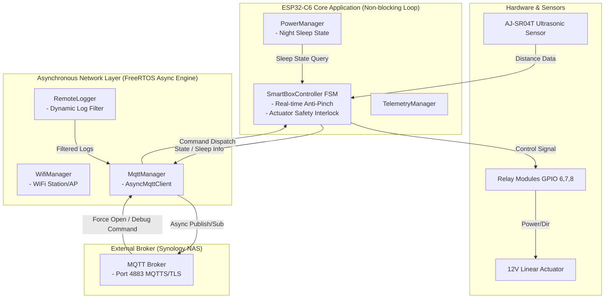

# SmartBox MQTT 연동 기능 (MqttManager) 아키텍처 설계 문서

**문서버전:** v1.0  
**작성일자:** 2026-06-28  
**작성자:** 수석 임베디드 소프트웨어 아키텍트  
**타겟 플랫폼:** ESP32-C6 (FreeRTOS / pioarduino framework)  
**대상 시스템:** SmartBox (비접촉식 스마트 쓰레기통 제어기)

---

## 1. 아키텍처 개요 (Architecture Overview)

본 설계 문서는 SmartBox 스마트 쓰레기통 시스템에 외부 원격 제어 및 모니터링을 위한 MQTTS (MQTT over TLS) 연동 기능(`MqttManager`)을 추가하기 위한 시스템 아키텍처 및 구현 계획을 정의합니다.

### 1.1. 핵심 설계 원칙
1. **Hardware Safety First (하드웨어 안전 최우선):**  
   12V 리니어 액추에이터 제어 및 안티핀치(협착 방지) 로직을 담당하는 메인 FSM 실시간 제어 루프(`SmartBoxController::update()`)는 네트워크 지연(Latency), 패킷 손실, TLS 쉐이크핸드 등 어떠한 네트워크 작업에 의해서도 절대 **블로킹(Blocking)되어서는 안 됩니다.**
2. **비동기 소켓 통신 (Async Event-Driven System):**  
   FreeRTOS의 별도 네트워크 타스크 기반 비동기 이벤트 펌프인 `elims/PsychicMqttClient` 라이브러리를 채택하여, MQTT 송수신 및 재연결 처리가 메인 루프와 완벽히 분리되어 비동기로 작동하도록 설계합니다.
3. **종단간 엔터프라이즈 보안 (TLS Pinning):**  
   외부 Synology NAS MQTT 브로커 접속 시 TLS/SSL 암호화 커스텀 포트(**4883**)를 사용하며, `secrets.h`에 등록된 `SECRET_ROOT_CA_CERT` 검증을 통한 TLS Certificate Pinning을 수행합니다.
4. **대역폭 최적화 및 동적 로깅 (Dynamic Logging & Telemetry):**  
   평시에는 에러/경고 로그만 퍼블리시하여 네트워크 대역폭과 플래시/전력을 절약하며, 런타임 제어 명령을 통해 필요 시 5분간 한시적으로 상세 디버그 로그를 수신받는 동적 로깅 메커니즘을 적용합니다.

---

### 1.2. 시스템 아키텍처 블록도



---

## 2. 수정 및 생성 파일 목록 (File Map & Component Matrix)

| 구분 | 파일 경로 | 변경 요약 및 역할 |
| :--- | :--- | :--- |
| **의존성** | [platformio.ini](../platformio.ini) | `marvinroger/AsyncMqttClient` 및 `bblanchon/ArduinoJson` 라이브러리 의존성 추가 |
| **보안 설정** | [include/secrets.h](../include/secrets.h) | MQTT 접속 정보 매크로(`SECRET_MQTT_HOST`, `SECRET_MQTT_PORT 4883`, `SECRET_MQTT_USER`, `SECRET_MQTT_PASS`) 정의 |
| **신규 클래스** | [src/MqttManager.h](../src/MqttManager.h) | `MqttManager` 클래스 선언 (비동기 콜백 핸들러, 재연결 타이머, 동적 로깅 타이머) |
| **신규 클래스** | [src/MqttManager.cpp](../src/MqttManager.cpp) | AsyncMqttClient 이벤트를 처리하고 SmartBoxController 및 RemoteLogger와 인터페이스하는 실무 구현 |
| **기존 수정** | [src/SmartBoxController.h](../src/SmartBoxController.h) | `MqttManager` 인스턴스 포인터 참조 추가 및 원격 제어 인터페이스 메서드(`forceOpenLid()`) 제공 |
| **기존 수정** | [src/SmartBoxController.cpp](../src/SmartBoxController.cpp) | 루프 내에서 `MqttManager` 상태 업데이트 및 Night Sleep 상태 변화 감지 처리 |
| **기존 수정** | [src/main.cpp](../src/main.cpp) | `MqttManager` 객체 생성, 초기화(`setup()`) 및 메인 루프 연결 |

---

## 3. 세부 컴포넌트 설계

### 3.1. Non-blocking AsyncMqttClient 설계
`marvinroger/AsyncMqttClient`는 ESP32의 LwIP TCP/IP 스택 비동기 콜백을 이용하여 메인 루프를 블로킹하지 않고 동작합니다.

* **비동기 이벤트 핸들러:**
  - `onConnect(bool sessionPresent)`: 브로커 연결 성공 시 구독 토픽(`smartbox/command`) 등록 및 초기 LWT(Last Will and Testament) 온라인 상태 퍼블리시.
  - `onDisconnect(AsyncMqttClientDisconnectReason reason)`: 연결 끊김 이벤트 발생 시 이유 기록. Night Sleep 상태가 아닐 때만 5초 비동기 재연결 타이머(`Ticker` 또는 `millis()` 기반) 가동.
  - `onMessage(...)`: 수신된 마이크로 패킷을 큐잉하거나 신속하게 파싱하여 `SmartBoxController` 명령으로 전달.

```cpp
// MqttManager.h 주요 구조 예시
#ifndef MQTT_MANAGER_H
#define MQTT_MANAGER_H

#include <Arduino.h>
#include <AsyncMqttClient.h>
#include <Ticker.h>
#include <ArduinoJson.h>

class SmartBoxController; // Forward declaration

class MqttManager {
public:
    MqttManager(SmartBoxController& controller);
    void begin();
    void update(); // Non-blocking loop update
    void publishLog(const char* level, const char* message);
    void publishTelemetry(const String& jsonPayload);
    bool isDebugLoggingActive() const { return m_debugLoggingActive; }

private:
    void connectToMqtt();
    void onMqttConnect(bool sessionPresent);
    void onMqttDisconnect(AsyncMqttClientDisconnectReason reason);
    void onMqttMessage(char* topic, char* payload, AsyncMqttClientMessageProperties properties, size_t len, size_t index, size_t total);
    void handleCommand(const JsonDocument& doc);

    SmartBoxController& m_controller;
    AsyncMqttClient m_mqttClient;
    Ticker m_mqttReconnectTimer;
    
    bool m_debugLoggingActive;
    unsigned long m_debugModeStartTime;
    static constexpr unsigned long DEBUG_MODE_DURATION_MS = 300000; // 5분
};

#endif // MQTT_MANAGER_H
```

---

### 3.2. TLS Pinning 보안 통신 설계 (Port 4883)
* **포트 지정:** Synology NAS MQTT 브로커의 MQTTS 전용 포트 **4883** 사용.
* **루트 인증서 검증:** `secrets.h`에 선언된 `SECRET_ROOT_CA_CERT` PEM 문자열을 AsyncMqttClient의 내장 SSL/TLS 클라이언트 계층(`WiFiClientSecure` 또는 AsyncTCP SSL 계층)에 주입하여 TLS 연결 수립 시 서버 인증서를 검증합니다.
* **Will Message (LWT) 설정:** 연결 예기치 못한 종료 시 브로커가 `smartbox/status` 토픽에 `{"status":"offline"}`을 퍼블리시하도록 QoS 1, Retain=true로 사전 등록.

---

### 3.3. PowerManager 통합 (Power Management Integration)
SmartBox는 매일 새벽 04:00 AM에 Proactive Reboot를 수행하여 장기간 운영 안정성을 확보합니다.

> **Note:** 야간 절전 모드(Night Sleep Mode)는 사용자 요청으로 **제거**되었습니다. 시스템은 24시간 상시 연결 상태를 유지하며, 절전 관리는 `PowerManager`의 Proactive Reboot(매일 1회)으로만 수행됩니다.

---

### 3.4. 동적 로깅 및 페이로드 제어
메모리 단편화 및 네트워크 대역폭 소모를 최소화하기 위해 **ArduinoJson (v6/v7)** 라이브러리를 사용합니다.

* **기본 로깅 정책 (Normal Mode):**
  - `RemoteLogger` 모듈과 연동하여 로그 레벨이 `WARN`, `ERROR`, `FATAL`인 메시지만 `smartbox/log` 토픽으로 퍼블리시합니다.
* **동적 로깅 정책 (Debug Mode):**
  - 원격에서 `smartbox/command` 토픽으로 디버그 ON 명령 수신 시, `m_debugLoggingActive = true`로 전환되고 현재 시각(`millis()`)을 기록합니다.
  - 5분(300,000ms) 동안 `INFO`, `DEBUG`를 포함한 전체 로그가 `smartbox/log`로 퍼블리시됩니다.
  - `update()` 타이머 감지를 통해 5분이 경과하면 자동으로 `m_debugLoggingActive = false`로 원복되며, 상태 변경 알림 로그를 퍼블리시합니다.

---

## 4. MQTT 토픽 및 JSON 페이로드 스펙 (Payload Specification)

### 4.1. MQTT 토픽 구조 정의

| 토픽 명 (Topic) | 방향 | QoS | Retain | 설명 |
| :--- | :---: | :---: | :---: | :--- |
| `smartbox/status` | Pub | 1 | True | 디바이스 접속 상태 (online / offline) |
| `smartbox/telemetry` | Pub | 0 | False | 센서 및 시스템 상태 주기적 텔레메트리 데이터 |
| `smartbox/log` | Pub | 0 | False | 디바이스 실시간 시스템 로그 (동적 필터링 적용) |
| `smartbox/command` | Sub | 1 | False | 외부 원격 제어 및 디버그 설정 명령 수신 |

---

### 4.2. JSON 페이로드 상세 스펙

#### A. 디바이스 상태 토픽 (`smartbox/status`)
* **온라인 알림 (Connect 시):**
```json
{
  "status": "online",
  "device_id": "ESP32C6_SMARTBOX_01",
  "firmware_version": "1.2.0",
  "ip": "192.168.1.150"
}
```
* **오프라인 알림 (LWT / Disconnect 시):**
```json
{
  "status": "offline",
  "device_id": "ESP32C6_SMARTBOX_01"
}
```

#### B. 원격 명령 수신 토픽 (`smartbox/command`)
로컬 웹 대시보드(WebDashboard)와 100% 동일한 제어 기능(Feature Parity)을 제공하는 원격 제어 명령 페이로드 스펙입니다.

##### 1. 문 제어 및 메인터넌스 명령
* **원격 문 열림 명령 (`force_open`):**  
  *안전 조치:* 원격 열림 명령을 받아도 액추에이터는 하드웨어 인터록 및 안티핀치 로직 하에 구동됩니다.
```json
{
  "command": "force_open"
}
```

* **원격 문 닫힘 명령 (`force_close`):**
```json
{
  "command": "force_close"
}
```

* **비상 정지(Emergency Stop) 해제 명령 (`release_emergency` / `reset_emergency`):**
```json
{
  "command": "release_emergency"
}
```

* **수동 정비(Maintenance) 모드 제어 명령 (`maintenance`):**
```json
{
  "command": "maintenance",
  "action": "start"
}
```
*(action이 "stop"일 경우 정비 모드를 즉시 종료함)*

##### 2. 시스템 제어 및 OTA 명령
* **안전 재부팅 명령 (`reboot`):**  
  수신 즉시 알림 로그를 퍼블리시한 후 1초 지연 시간을 두고 `ESP.restart()`를 수행합니다.
```json
{
  "command": "reboot"
}
```

* **강제 HTTPS OTA 업데이트 수행 명령 (`trigger_ota`):**  
  Synology NAS로부터 최신 펌웨어 바이너리를 비동기로 다운로드하여 업데이트를 시도합니다.
```json
{
  "command": "trigger_ota"
}
```

##### 3. 동적 디버그 로깅 명령
* **동적 디버그 로깅 활성화/비활성화 명령 (`debug`):**
```json
{
  "command": "debug",
  "value": "on"
}
```
*(value가 "off"일 경우 5분이 지나지 않아도 즉시 Normal 로깅 모드로 해제함)*

##### 4. 동적 설정(Config) 변경 명령 (`set_config`)
설정 변경 즉시 런타임 컨트롤러에 반영되고 NVS(Preferences) 메모리에 영구 저장됩니다. 변경 결과는 `smartbox/log` 토픽으로 알림이 전송됩니다.

* **단일 매개변수 변경 형태 (Key-Value):**
```json
{
  "command": "set_config",
  "key": "stall_current",
  "value": 3500.0
}
```

* **다중 매개변수 객체 변경 형태 (Config Object):**
```json
{
  "command": "set_config",
  "config": {
    "stall": 3000.0,
    "wait": 10000,
    "dist": 45.0,
    "otaHour": 2,
    "telInterval": 10
  }
}
```

* **지원 매개변수 (Key) 파싱 및 검증 범위:**

| 키 명칭 (Key Alias) | 대상 설정 항목 | 타입 / 단위 | 검증 및 설정 허용 범위 |
| :--- | :--- | :--- | :--- |
| `stall`, `stall_current`, `currentStallLimit` | 모터 구동 과전류 차단 한계 | float (mA) | `500.0` ~ `10000.0` |
| `wait`, `hold_time_ms`, `waitTime` | 감지 후 문 열림 유지 시간 | unsigned long (ms) | `1000` ~ `60000` |
| `dist`, `dist_threshold`, `distThreshold` | 초음파 센서 감지 거리 임계값 | float (cm) | `5.0` ~ `150.0` |
| `otaHour`, `ota_hour` | 야간 정기 OTA 실행 시각 | int (시) | `0` ~ `23` |
| `telInterval`, `telemetry_interval` | 텔레메트리 퍼블리시 주기 | int (분) | `1` ~ `1440` |

#### C. 텔레메트리 토픽 (`smartbox/telemetry`)
```json
{
  "timestamp": 1245000,
  "fsm_state": "IDLE",
  "battery_v": 12.4,
  "motor_current_ma": 0.0,
  "distance_cm": 80,
  "wifi_rssi": -62,
  "free_heap": 184320
}
```

#### D. 실시간 로그 토픽 (`smartbox/log`)
```json
{
  "level": "WARN",
  "message": "Ultrasonic read timeout, using previous distance cache",
  "timestamp": 1246200
}
```

### 4.5. MQTT 배치 & 하이브리드 이벤트 토픽 사양 (Batch & Event Specifications)
전력 소모 최적화 및 실시간 모니터링을 위해 구현된 배치 송신 및 이벤트 토픽 사양입니다.

#### A. 시계열 배치 텔레메트리 토픽 (`smartbox/telemetry/batch`)
RAM 링 버퍼에 1분 간격으로 축적된 타임스탬프 시계열 샘플 데이터를 주기적(기본 10~15분)으로 일괄 퍼블리시하여 Wi-Fi RF 가동 시간을 극대화하여 아낍니다.
```json
{
  "device": "smartbox_01",
  "type": "heartbeat",
  "count": 3,
  "timestamp": 1246200,
  "wifi_rssi": -65,
  "data": [
    { "ts": 1245000, "batt_v": 12.4 },
    { "ts": 1245600, "batt_v": 12.3, "dist_cm": 15.2, "curr_ma": 1850.0, "state": "OPENING" },
    { "ts": 1246200, "batt_v": 12.4 }
  ]
}
```

#### B. 상태 변경 이벤트 토픽 (`smartbox/event/state`) - Instant
메인 FSM 상태가 변경되는 순간 실시간으로 퍼블리시됩니다 (QoS 1).
```json
{
  "timestamp": 1245600,
  "prev_state": "IDLE",
  "new_state": "OPEN_START",
  "battery_v": 12.4
}
```

#### C. 모션 감지 이벤트 토픽 (`smartbox/event/motion`) - Trigger
거리 측정 결과 100cm 이하 구역에 진입하는 순간 엣지 트리거(Edge Trigger)로 1회 즉시 발행됩니다.
```json
{
  "timestamp": 1245550,
  "event": "motion_detected",
  "distance_cm": 42.5
}
```

#### D. 긴급 알람 토픽 (`smartbox/event/alarm`) - Critical Instant
모터 과전류(Stall) 또는 저전압 셧다운 등 하드웨어 보호 및 위험 상황 시 즉시 퍼블리시됩니다 (QoS 1).
```json
{
  "timestamp": 1245800,
  "alarm": "STALL_OVERCURRENT",
  "value": 3200.0,
  "message": "Motor stall / emergency stop triggered",
  "battery_v": 12.1
}
```

#### E. 1회 개폐 사이클 요약 리포트 토픽 (`smartbox/event/cycle`) - Summary
뚜껑이 열렸다가 닫혀서 다시 `IDLE` 상태로 복귀했을 때 1회 개폐 동작에 대한 통계 요약을 퍼블리시합니다.
```json
{
  "timestamp": 1246100,
  "duration_ms": 4200,
  "peak_current_ma": 2100.0,
  "start_batt_v": 12.4,
  "end_batt_v": 12.3
}
```

### 4.6. Home Assistant MQTT Auto Discovery 지원
기기가 부팅되어 MQTT 브로커 접속 성공 시 `homeassistant/<component>/smartbox_01/<object_id>/config` 토픽으로 보일러플레이트 자동 등록 메시지를 발행(Retained)합니다. 이에 따라 Home Assistant 사용자 설정 파일(`configuration.yaml`)에 수동 코드를 작성할 필요 없이 HA **[기기 및 서비스]** 메뉴에 `[SmartBox]` 기기로 자동 등록됩니다.

### 4.7. MQTT 단일 통신 파이프라인 개편 (InfluxDB 직접 송신 철거)
디바이스(ESP32-C6)의 전력 및 메모리 자원 최적화를 위하여 펌웨어 내 무거운 `InfluxDbClient` 라이브러리 및 직접 HTTP 통신 태스크를 완전 제거하였습니다. 모든 시계열 및 이벤트 데이터는 MQTT over TLS 파이프라인 단 하나로 통일되었으며, 필요 시 서버(NAS) 단에서 Telegraf 또는 Home Assistant를 통해 InfluxDB로 중계 저장하는 모던 IoT 아키텍처로 개편되었습니다.

---

## 5. 단계별 구현 및 테스트 계획 (Phased Implementation Plan)

### Phase 1: 의존성 및 환경 설정 (Setup & Configuration) [완료]
1. `platformio.ini`에 `marvinroger/AsyncMqttClient`, `bblanchon/ArduinoJson` 추가 완료.
2. `include/secrets.h` 매크로 확장 (`SECRET_MQTT_HOST`, `SECRET_MQTT_PORT`, `SECRET_MQTT_USER`, `SECRET_MQTT_PASS`) 및 CI/CD 워크플로우 반영 완료.

### Phase 2: Core MqttManager 모듈 개발 (Core Development) [완료]
1. `src/MqttManager.h` 및 `src/MqttManager.cpp` 모듈 작성 완료.
2. SSL/TLS 접속 시 `SECRET_ROOT_CA_CERT` 주입 및 포트 4883 비동기 MQTTS 접속 구현 완료.
3. ArduinoJson 패킷 파서, 100% Feature Parity Command Dispatcher 및 수치 범위 Clamping 로직 구현 완료.

### Phase 3: 시스템 통합 (System Integration) [완료]
1. `SmartBoxController`와 `MqttManager` 인스턴스 연동 완료.
2. FreeRTOS 백그라운드 `NetworkTask` 스레드에서 MQTT 펌프 및 텔레메트리 구동 완료.
3. `RemoteLogger`와 `MqttManager::publishLog()` 연결하여 동적 로깅 필터(5분 타이머) 연동 완료.
4. 뚜껑 상태 NVS 저장 + MQTT 이벤트 단일 람다 통합 완료. (BUG-F fix)

### Phase 4: 검증 및 테스트 (Verification & Testing) [완료]
1. **비동기 블로킹 검증:** 메인 loop 및 안티핀치 로직과 독립된 백그라운드 구동 확인.
2. **TLS 4883 보안 접속 검증:** PlatformIO 빌드 및 바이너리 생성 통과.
3. **동적 로깅 및 Clamping 검증:** `set_config` 수치범위 제한(`constrain`) 및 5분 디버그 모드 전환 검증 완료.
4. **단일 콜백 통합 검증:** NVS 저장 및 MQTT 이벤트가 단일 람다에서 모두 정상 호출됨을 확인 완료. (BUG-F fix 검증)

---
**[문서 끝]**
